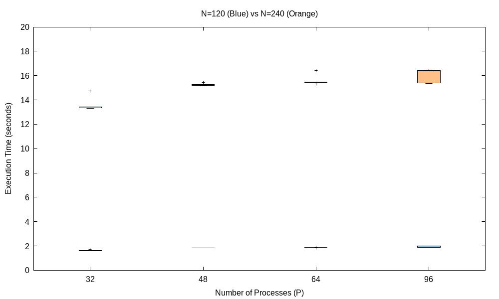

## Course Instructor (CS633 Parallel Computing)

**Prof. Preeti Malalkar**

---

## Team Members (Group 22)

- **Harsh Goel** — 251110034
- **Kishan Kumar Mishra** — 251110044
- **Aditya Pushkar** — 251110004
- **Govind Gupta** — 251110033

---

# Parallel 3D Stencil Computation & Isovalue Extraction using MPI

## Overview

This project implements a **distributed-memory 3D stencil computation and isovalue (voxel) intersection pipeline using MPI**. The global simulation domain is decomposed across a 3D Cartesian process grid `(px, py, pz)`, and each process:

1. Owns a local sub-domain `(nx, ny, nz)` wrapped in a **halo region**
2. Performs **halo exchange** with its 6 face-neighbours using non-blocking MPI
3. Computes a **`d`-point stencil** (spatial average) over its local sub-domain for `T` timesteps, on `F` independent scalar fields
4. Extracts **isovalue intersections** (marching-cubes-style voxel tests) from the stencil results at every timestep

The design is built around **communication–computation overlap**: halo exchanges are issued with `MPI_Isend`/`MPI_Irecv` and the CPU works on interior (halo-independent) data while the network transfers boundary data in the background.

Performance is measured across:
- Number of processes: `P = 32, 48, 64, 96`
- Grid size: `N = 120, 240` (global domain dimension)
- 5 repeated runs per `(P, N)` configuration

Results are visualized as **boxplots** to capture both average execution time and its run-to-run variability.

---

## Code Logic and Implementation

### 1. 3D Domain Decomposition and Layout

The global simulation space is partitioned into a Cartesian grid of processes defined by `(px, py, pz)`. Each process manages a local sub-domain `(nx, ny, nz)`.

- **Halo regions and total dimensions**: each sub-domain is wrapped in a "ghost"/halo region of thickness `h = d / 6`, giving a total per-process allocation of:

  ```
  nx_tot = nx + 2h,  ny_tot = ny + 2h,  nz_tot = nz + 2h
  ```

  Real data occupies indices `h .. nx+h-1` (and similarly for y, z); the surrounding band is halo.

- **Memory serialization**: data is stored as a 1D contiguous `double` array, indexed via:

  ```c
  IDX(x, y, z) = x * (ny_tot * nz_tot) + y * nz_tot + z
  ```

  Z is the fastest-changing index, so the innermost loop accesses contiguous memory — this keeps cache misses low during the hot stencil loop.

### 2. Halo Exchange

Each process exchanges data across all 6 faces with its neighbours using `MPI_Isend` / `MPI_Irecv`. Boundary processes use `MPI_PROC_NULL` for non-existent neighbours, so the exchange logic stays **uniform** regardless of a process's position in the grid — no special-casing needed at the domain edges.

Custom `MPI_Type_indexed` datatypes describe each face (X, Y, Z; both send and receive sides), enabling **zero-copy** transfer of non-contiguous 3D face data straight out of the 1D buffer, without manual packing/unpacking.

### 3. The `d`-Point Stencil

The stencil approximates a physical property by averaging neighbouring points:

- **Stencil masking**: a `weight_mask` marks each neighbour as valid (`1.0`) or invalid (`0.0`) — points on the true global boundary don't have a full neighbour set.
- **Normalization**: a precomputed `divisors` array stores the count of valid neighbours per point, so the average is correct even near boundaries.

### 4. Isovalue Intersection (Voxel Analysis)

- Each voxel is a `1×1×1` unit cube; its 8 corner values are sampled.
- A voxel is flagged as **intersected** iff `min(corners) ≤ isovalue ≤ max(corners)`.

**Ownership / deduplication**: voxels straddling a process boundary are owned only by the process with the **lower rank coordinate** in that dimension ("right-ordering" rule). Additional index bounds prevent edges/corners shared by the X, Y, Z boundary faces from being double-counted within a single process.

---

## Code Optimizations

### Communication–Computation Overlap (Latency Hiding)

**Stencil computation:**
1. Initiate halo exchange (`MPI_Isend` / `MPI_Irecv`)
2. Compute the stencil for the **inner core** (points independent of neighbour data) while data is in transit
3. `MPI_Waitall` to synchronize
4. Compute the stencil for the **boundary slabs** (neighbour-dependent regions)

**Isovalue computation:**
1. Initiate halo exchange of the updated stencil results
2. Concurrently process all **internal voxels** that don't cross a process boundary
3. `MPI_Waitall` to synchronize
4. Process the remaining **straddling voxels** via `compute_ngbr_isovalues`

This dual-layered overlap keeps each process doing useful work for nearly the entire halo-exchange latency window.

### Advanced MPI Datatypes (Zero-Copy Transfer)

`MPI_Type_indexed` lets MPI understand the non-contiguous layout of a 3D face directly in the 1D buffer, avoiding manual buffer packing overhead entirely.

---

## Project Structure

```
├── src.c                    # MPI implementation (decomposition, halo exchange, stencil, isovalues)
├── plot_script.c            # Boxplot generator (gnuplot pipeline)
├── boxplot_timing.png       # Execution-time boxplot (P vs N)
├── timing.txt               # Raw execution timing results
├── job_scripts/              # SLURM submission scripts per configuration
├── job_output_files/         # SLURM stdout/stderr logs
└── Group22.pdf               # Detailed project report
```

---

## Compilation & Execution

### 1. Compile

```bash
mpicc -O3 -o src src.c -lm
```

### 2. Run

The program takes 12 positional arguments:

```bash
mpirun -np <P> ./src <d> <ppn> <px> <py> <pz> <nx> <ny> <nz> <T> <seed> <F> <isovalue>
```

| Arg | Meaning |
|---|---|
| `d` | Stencil order (halo thickness `h = d / 6`) |
| `ppn` | Processes per node |
| `px py pz` | Process-grid decomposition (`P = px * py * pz`) |
| `nx ny nz` | Local sub-domain size per process |
| `T` | Number of timesteps |
| `seed` | Random seed for synthetic data generation |
| `F` | Number of independent scalar fields |
| `isovalue` | Threshold used for voxel intersection testing |

Example (`P = 32`, `px,py,pz = 4,4,2`):

```bash
mpirun -np 32 ./src 6 8 4 4 2 30 30 60 5 42 2 0.5
```

### 3. Cluster execution (SLURM)

```bash
sbatch job_scripts/run_32.sh
sbatch job_scripts/run_48.sh
sbatch job_scripts/run_64.sh
sbatch job_scripts/run_96.sh
```

Each job appends a timing row to `timing.txt` and writes logs to `job_output_files/`.

### 4. Generate the boxplot

```bash
gcc plot_script.c -o plot_script
./plot_script
```

Output: `boxplot_timing.png`

---

## Results

### Execution time analysis

**Table 1 — Average execution time per configuration**

| P | N | px | py | pz | Avg Time (s) |
|---|---|----|----|----|----|
| 32 | 120 | 4 | 4 | 2 | 1.635 |
| 48 | 120 | 6 | 4 | 2 | 1.841 |
| 64 | 120 | 4 | 4 | 4 | 1.866 |
| 96 | 120 | 6 | 4 | 4 | 1.918 |
| 32 | 240 | 4 | 4 | 2 | 13.654 |
| 48 | 240 | 6 | 4 | 2 | 15.258 |
| 64 | 240 | 4 | 4 | 4 | 15.618 |
| 96 | 240 | 6 | 4 | 4 | 16.022 |

### Boxplot



*Execution time vs. number of processes (P), with N = 120 (lower cluster) and N = 240 (upper cluster) each shown as separate boxes per P.*

### What the results show

- **Scaling with problem size (N):** doubling `N` from 120 → 240 increases execution time by roughly **8×** at every process count. Since `2³ = 8`, this matches an `O(N³)` computational complexity — exactly what's expected for a full 3D grid stencil + voxel scan, where the point count grows with the cube of the linear dimension.
- **Scaling with processes (P):** execution time **rises** as `P` goes from 32 → 48 → 64 → 96, at both grid sizes. Adding processes shrinks each rank's local sub-domain (less local work), but this saving is **outweighed by growing inter-process communication and synchronization cost** — more ranks means more halo-exchange messages and more `MPI_Waitall` synchronization points per timestep.
- **Variability (box height):** the spread is visibly tighter at `N = 120` than at `N = 240` — larger messages and more voxel work per timestep leave more room for run-to-run jitter (scheduling, network contention) to show up in wall-clock time. A few outlier points (e.g., at `P = 32, N = 240` and `P = 64, N = 240`) reflect occasional slower runs, which the boxplot surfaces immediately, unlike a bar chart of averages.
- **Net takeaway:** for this workload, weak/strong scaling past `P ≈ 32–48` gives **diminishing (in fact negative) returns** — the communication overhead of `d`-point halo exchange starts to dominate before compute-bound gains from added parallelism can offset it.

### Intersected voxel count analysis

**Table 2 — Isovalue intersection count per iteration** (`Run = 1, P = 32, N = 120, px=4, py=4, pz=2`)

| Iteration | Property 1 | Property 2 |
|---|---|---|
| 1 | 311,071 | 312,561 |
| 2 | 79,123 | 80,927 |
| 3 | 25,938 | 26,272 |
| 4 | 13,459 | 13,395 |
| 5 | 10,807 | 10,864 |

The intersected voxel count **drops sharply and monotonically** across iterations. Each stencil pass averages every point with its neighbours, pulling values toward a local mean and **shrinking the value range within each voxel**. As the range narrows, fewer voxels straddle the fixed isovalue threshold — so the number of true intersections decays iteration over iteration, converging as the field smooths out.

---

## Key Concepts Used

1. 3D Cartesian domain decomposition
2. Non-blocking MPI point-to-point communication (`MPI_Isend`, `MPI_Irecv`, `MPI_Waitall`)
3. Custom MPI derived datatypes (`MPI_Type_indexed`) for zero-copy face transfers
4. Communication–computation overlap (latency hiding)
5. Halo/ghost-cell exchange pattern
6. `d`-point stencil computation with boundary-aware weighting/normalization
7. Isovalue (voxel) intersection extraction with ownership-based deduplication
8. `MPI_Reduce` for global aggregation (isovalue counts, max execution time)
9. Boxplot-based performance variability analysis
10. SLURM job scheduling for cluster execution

---

## Conclusions

- The algorithm's execution time scales as **`O(N³)`** with grid size, consistent with the volumetric nature of 3D stencil and voxel computations.
- Execution time **increases with P** across the tested range — communication and synchronization overhead from halo exchange outweighs the benefit of smaller per-process sub-domains.
- Communication–computation overlap (via non-blocking sends/receives and inner-core-first computation ordering) helps hide latency but does not eliminate the fundamental communication cost that grows with process count.
- The isovalue intersection count decreasing over iterations is a direct, expected consequence of the stencil's smoothing effect on the field.
- Custom MPI derived datatypes (`MPI_Type_indexed`) avoid manual packing overhead and keep the halo-exchange code uniform across all boundary cases via `MPI_PROC_NULL`.

---

## Possible Improvements

1. Explore non-cubic process-grid decompositions to better balance surface-to-volume ratio (communication vs. computation) per process
2. Use MPI persistent communication (`MPI_Send_init` / `MPI_Recv_init`) to reduce per-timestep setup overhead across `T` iterations
3. Profile communication vs. computation time separately (not just wall-clock) to quantify exactly how much of the P=96 slowdown is communication-bound
4. Explore hybrid MPI+OpenMP to reduce process count (and thus halo-exchange messages) while keeping core utilization high

---

## Report

Detailed explanation of the code, decomposition strategy, optimizations, and full results are provided in **`Group22.pdf`**.
